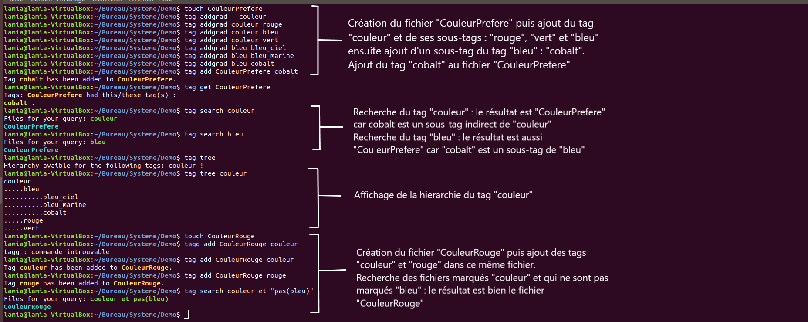
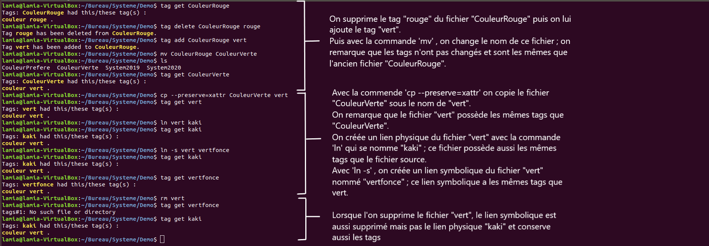
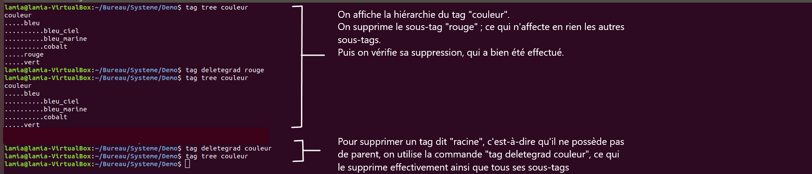

# SY6-FileTags

## Développement

Dans un premier temps nous nous sommes demandé comment lier les tags avec les fichiers.

Voici un représentation simplifié (avec les méthodes publiques) du diagramme du projet:

[![](https://mermaid.ink/img/eyJjb2RlIjoiY2xhc3NEaWFncmFtXG5cbiAgICAgIGNsYXNzIFRhZ3tcbiAgICAgICAgK2dldChpbnQsIGNoYXIqKSB2b2lkXG4gICAgICAgICthZGQoaW50LCBjaGFyKikgdm9pZFxuICAgICAgICArZGVsZXRlKGludCwgY2hhciopIHZvaWRcbiAgICAgICAgK3RydW5jYXRlKGludCwgY2hhciopIHZvaWRcbiAgICAgICAgK3NlYXJjaChpbnQsIGNoYXIqKSB2b2lkXG4gICAgICAgICthZGRncmFkKGludCwgY2hhciopIHZvaWRcbiAgICAgICAgK2RlbGV0ZWdyYWQoaW50LCBjaGFyKikgdm9pZFxuICAgICAgICArdHJlZShpbnQsIGNoYXIqKSB2b2lkXG4gICAgICAgICtoZWxwKCkgdm9pZFxuICAgICAgfVxuICAgICAgY2xhc3MgRGF0YWJhc2V7XG4gICAgICAgICAraW5pdF9kYigpIHZvaWRcbiAgICAgICAgICtpbnNlcnRfZGIoY2hhciosIGNoYXIqKSBpbnRcbiAgICAgICAgICtkZWxldGVfZGIoY2hhciopIGludFxuICAgICAgICAgK2Zyb21fY2hpbGRfdG9fcGFyZW50KGNoYXIqKSBjaGFyKlxuICAgICAgICAgK2Zyb21fcGFyZW50X3RvX2NoaWxkcmVuKGNoYXIqKSBjaGFyKlxuICAgICAgfVxuICAgICAgY2xhc3MgQ29uZmlne1xuICAgICAgICBHTE9CQUxMWVxuICAgICAgICBEQVRBQkFTRVxuICAgICAgICBET0NTXG4gICAgICAgIEFUVFJcbiAgICAgICAgU1FMX0ZJTEVcbiAgICAgIH1cbiAgICAgIGNsYXNzIEhlbHBlcntcbiAgICAgICAgK2NvbmNhdChjaGFyKixjaGFyKikgY2hhcipcbiAgICAgICAgK2lzRmlsZShjaGFyKikgaW50XG4gICAgICAgICtub3RDdXJyZW50KGNoYXIqKSBpbnRcbiAgICAgICAgK3JlYWRTdHJpbmcoY2hhciopIGNoYXIqXG4gICAgICAgICtzdHJTdGFydFdpdGgoY2hhciopIGludFxuICAgICAgICArc3Vic3RyKGNoYXIqLGludCxpbnQpIGNoYXIqXG4gICAgICB9XG5cbiAgICAgIGNsYXNzIEluaXR7XG4gICAgICAgICttYWluKCkgdm9pZFxuICAgICAgfVxuXG4gICAgICBjbGFzcyBNYWlue1xuICAgICAgICArY2hhciAqb3B0aW9uc1tdXG4gICAgICAgICtnZXRPcHRpb24oY2hhciopXG4gICAgICAgICttYWluKGludCxjaGFyKilcbiAgICAgIH1cblxuICAgICAgTWFpbiA8Li4gVGFnXG4gICAgICBUYWcgPC4uIERhdGFiYXNlXG4gICAgICBUYWcgPC4uIEhlbHBlclxuICAgICAgRGF0YWJhc2UgPC4uIEhlbHBlclxuICAgICAgRGF0YWJhc2UgPC4uIENvbmZpZ1xuICAgICAgVGFnIDwuLiBDb25maWdcblxuIiwibWVybWFpZCI6eyJ0aGVtZSI6ImRlZmF1bHQifSwidXBkYXRlRWRpdG9yIjpmYWxzZX0)](https://mermaid-js.github.io/mermaid-live-editor/#/edit/eyJjb2RlIjoiY2xhc3NEaWFncmFtXG5cbiAgICAgIGNsYXNzIFRhZ3tcbiAgICAgICAgK2dldChpbnQsIGNoYXIqKSB2b2lkXG4gICAgICAgICthZGQoaW50LCBjaGFyKikgdm9pZFxuICAgICAgICArZGVsZXRlKGludCwgY2hhciopIHZvaWRcbiAgICAgICAgK3RydW5jYXRlKGludCwgY2hhciopIHZvaWRcbiAgICAgICAgK3NlYXJjaChpbnQsIGNoYXIqKSB2b2lkXG4gICAgICAgICthZGRncmFkKGludCwgY2hhciopIHZvaWRcbiAgICAgICAgK2RlbGV0ZWdyYWQoaW50LCBjaGFyKikgdm9pZFxuICAgICAgICArdHJlZShpbnQsIGNoYXIqKSB2b2lkXG4gICAgICAgICtoZWxwKCkgdm9pZFxuICAgICAgfVxuICAgICAgY2xhc3MgRGF0YWJhc2V7XG4gICAgICAgICAraW5pdF9kYigpIHZvaWRcbiAgICAgICAgICtpbnNlcnRfZGIoY2hhciosIGNoYXIqKSBpbnRcbiAgICAgICAgICtkZWxldGVfZGIoY2hhciopIGludFxuICAgICAgICAgK2Zyb21fY2hpbGRfdG9fcGFyZW50KGNoYXIqKSBjaGFyKlxuICAgICAgICAgK2Zyb21fcGFyZW50X3RvX2NoaWxkcmVuKGNoYXIqKSBjaGFyKlxuICAgICAgfVxuICAgICAgY2xhc3MgQ29uZmlne1xuICAgICAgICBHTE9CQUxMWVxuICAgICAgICBEQVRBQkFTRVxuICAgICAgICBET0NTXG4gICAgICAgIEFUVFJcbiAgICAgICAgU1FMX0ZJTEVcbiAgICAgIH1cbiAgICAgIGNsYXNzIEhlbHBlcntcbiAgICAgICAgK2NvbmNhdChjaGFyKixjaGFyKikgY2hhcipcbiAgICAgICAgK2lzRmlsZShjaGFyKikgaW50XG4gICAgICAgICtub3RDdXJyZW50KGNoYXIqKSBpbnRcbiAgICAgICAgK3JlYWRTdHJpbmcoY2hhciopIGNoYXIqXG4gICAgICAgICtzdHJTdGFydFdpdGgoY2hhciopIGludFxuICAgICAgICArc3Vic3RyKGNoYXIqLGludCxpbnQpIGNoYXIqXG4gICAgICB9XG5cbiAgICAgIGNsYXNzIEluaXR7XG4gICAgICAgICttYWluKCkgdm9pZFxuICAgICAgfVxuXG4gICAgICBjbGFzcyBNYWlue1xuICAgICAgICArY2hhciAqb3B0aW9uc1tdXG4gICAgICAgICtnZXRPcHRpb24oY2hhciopXG4gICAgICAgICttYWluKGludCxjaGFyKilcbiAgICAgIH1cblxuICAgICAgTWFpbiA8Li4gVGFnXG4gICAgICBUYWcgPC4uIERhdGFiYXNlXG4gICAgICBUYWcgPC4uIEhlbHBlclxuICAgICAgRGF0YWJhc2UgPC4uIEhlbHBlclxuICAgICAgRGF0YWJhc2UgPC4uIENvbmZpZ1xuICAgICAgVGFnIDwuLiBDb25maWdcblxuIiwibWVybWFpZCI6eyJ0aGVtZSI6ImRlZmF1bHQifSwidXBkYXRlRWRpdG9yIjpmYWxzZX0)

### Choix d'implementation

* Chaque tag et chaque hierachie de tag est propre à chaque utilisateur.
* Le stockage des tag est réalisé grâce au module ```xattr``` et la hièrarchie grâce à une base de données.

### Tag pour un fichier

Durant la phase de recherche, nous avons découvert le module xattr. 
Dans un premier temps, c’était surtout la contrainte de rendre notre système de tag compatible avec le gestionnaire de fichiers Unix qui nous a posé problème.
En explorant les fonctionnalités du module xattr, nous avons compris que ce dernier allait nous permettre de réaliser le projet. De plus, les commandes du SGF comme ```cp```, ```mv```, ```ln``` permettent de garder les tags, puisque xattr se base sur les inoeud.

Pour la commande ```cp``` il faut l'utiliser ainsi pour garder les tags: 

```sh
$ cp --preserve=xattr original copy
```
Il y aussi une commande qui permet d’effacer tous les tags d’un fichier :

```sh 
$ tag truncate file
``` 

### Hiérarchie 

Dans un second temps, la fonctionnalité sur la hiérarchie entre le tags nous a demandé de la réflexion par rapport à une structure de donnée pour stocker et définir la hiérarchie.


Un choix évident était les B-Arbres équilibré par la hiérarchie. Mais pour récupérer les tags à partir du ```fils``` vers le ```parent``` n’était ni évident, ni optimale.

Finalement nous avons fait le choix d’utiliser une base de donnée. SQLite nous a paru un excellent choix, car c’est une base de donnée légère et est rapide à mettre en place.  Cette dernière contient une unique table avec les champs suivants: ``` id - category - parent ```.  Cette architecture permet de définir une hiérarchie correcte entre les tags. 
Cependant nous avons eu des difficultés pour la suppression d’un tag, puisque si on supprime un tag parent, il faut aussi supprimer tous les fils, or nous n’avions pas réussi à faire utiliser les clés étrangères dans ```sqlite3```, nous l’avons donc fait manuellement.


Les commandes ```addgrad``` et ```deletegrad``` permettent d’ajouter une hiérarchie ou de la supprimer entièrement :

```sh 
$ tag addgrad _ couleur
$ tag addgrad couleur bleu 
$ tag addgrad bleu cobalt
``` 
Avec ces commandes on a créé une hiérarchie de avec comme racine “couleur” , “bleu” est le fils de “couleur” et “cobalt” est le fils de "bleu".

```sh 
$ tag deletegrad couleur  
```  
Avec cette commande on supprime entièrement la hiérarchie “couleur” ce qui signifie que “bleu” et “cobalt” seront aussi supprimé.

### Liaison tag et hiérarchie

La commande ```search``` permet de rechercher un fichier. Par exemple, supposons que nous avons la hiérarchie suivante: color -> red et color -> green et qu’on dispose de deux fichiers: ```a``` avec le tag red et ```b``` avec le tag green. La commande recherche suivante permet de trouver ces deux fichiers :

```sh 
$ tag search color
```

Et la recherche suivante ne permet d’obtenir comme résultat que le fichier ```a``` :

```sh 
$ tag search color et pas(green)
```

```search``` se charge de rechercher les tags d’un fichier, et d'aller vérifier les hiérarchies disponibles pour ces tags, puis récupère les tags ```fils``` vers le tag ```parent```.
La syntaxe sera légèrement différente de celle du sujet, prenons pour exemple celui du sujet:
‘ “systeme” et “L3” et pas(“2019”) ’
Pour effectuer cette recherche avec search , il faudra l’écrire ainsi :

```sh 
$ tag search systeme et L3 et "pas(2019)"
```

L'utilisation des guillemets est importante pour le shell!

## Démonstration en image

On utilise les mêmes fichiers pour chaque exemple, par exemple le fichier ```CouleurRouge``` est le même dans le premier exemple et dans le deuxième. 

### Exemple d'utilisation de la recherche et de l'ajout de tags




### Exemple d'utilisation avec  ```cp```,  ```mv```, ```ln``` ,  ```ln -s``` et  ```rm```





### Exemple d'utilisation de  ```deletegrad```




#### Exemple d'utilisation de ```truncate```


